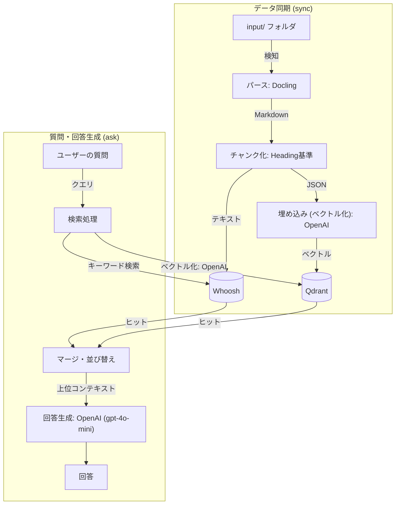

# RAG PoC CLI (v0.9.7)

本プロジェクトは、RAG (Retrieval Augmented Generation) の内部処理を可視化・説明可能にすることを目的とした、CLI（コマンドライン）ベースのPoC（概念実証）環境です。

ブラックボックスになりがちなRAGの「パース」「チャンク化」「検索」「回答生成」の各工程を分離し、それぞれの中間成果物やデバッグ情報をファイルとして保存することで、処理の透明性を確保しています。

## 主な機能と特徴

- **差分更新 (`sync`)**: ファイルのハッシュ値を管理し、変更のあったファイルだけを自動でパース・チャンク化・埋め込み・インデックス更新します。
- **ハイブリッド検索**: キーワード検索（BM25）とベクトル検索を組み合わせ、RRF (Reciprocal Rank Fusion) スコアを用いて統合された順位付けを行います。
- **日本語対応**: キーワード検索エンジンに形態素解析器（Janome）を組み込んでおり、日本語の文章でも適切に検索できます。
- **柔軟な入力**: 各コマンドは、単一のファイルだけでなく、**フォルダを指定しての一括処理（バッチ処理）**にも対応しています。
- **可視化**: 検索結果のヒット理由や、各エンジンのスコア（またはヒット有無）をデバッグJSONとして出力します。
- **省メモリ設計**: デフォルトでは重いOCR処理をオフにしており、巨大なPDFは自動（または手動）で分割して処理することが可能です。
- **回答生成 (RAG)**: 検索結果を元に、LLM（OpenAI）が事実に基づいた回答を生成します。
- **パス・設定のポータビリティ (CWD非依存)**: 実行ディレクトリ（カレントディレクトリ）に関わらず、スクリプトの配置場所からプロジェクトルートを自動検出し、設定や同期状態を動的に解決します。同期状態ファイルのパス情報も相対パスで管理されるため、ディレクトリの移動時にも高い移植性を持ちます。
- **AIエージェント統合用ドライラン**: `ask` コマンドに `--dry-run` フラグを指定することで、外部のLLMやAIエージェント（`claude code` や `codex` など）にそのまま流し込める形式の「プロンプトのみ」を標準出力（stdout）に出力できます。

## システム構成

- **文書解析 (Parse)**: [Docling](https://github.com/DS4SD/docling) (PDF, PPTX などを Markdown に変換)
- **チャンク化 (Chunk)**: Markdown の見出し（Heading）ベースの独自ロジック
- **キーワード検索 (BM25)**: [Whoosh](https://whoosh.readthedocs.io/) + [Janome](https://mocobeta.github.io/janome/)
- **ベクトル検索 (Vector)**: [Qdrant](https://qdrant.tech/) (ローカルファイルモード) + OpenAI `text-embedding-3-small`
- **回答生成 (Generation)**: OpenAI `gpt-4o-mini`

## ハイブリッド検索とRRF (Reciprocal Rank Fusion)

本システムは、検索精度を高めるため、キーワード検索（BM25）とベクトル検索（OpenAI Embeddings + Qdrant）によるハイブリッド検索を採用しています。

両エンジンの検索結果をマージ・順位付けするために **RRF (Reciprocal Rank Fusion)** スコアを使用しています。RRFは、各エンジンにおける順位をもとに、以下の式で総合スコアを計算します。

$$\text{RRF Score} = \sum_{m \in M} \frac{1}{60 + r_m(d)}$$

ここで、$M$ はマッチした検索エンジン（WhooshおよびQdrant）の集合、$r_m(d)$ はエンジン $m$ におけるチャンク $d$ の順位（1から始まるインデックス）です。

### 同点（タイ）時の決定論的ルール
RRFスコアが同一のチャンクが発生した場合、検索結果の再現性を保証するために、以下の優先順位で並び替えます（タイブレーカー）：
1. RRFスコア（降順）
2. どちらか一方の検索エンジンで獲得した最も高い順位（昇順、つまり順位が良い方）
3. チャンクIDのアルファベット順（昇順）

### デバッグ情報の保存
検索が実行されると、詳細なスコアリング過程（各エンジンの順位、計算されたRRFスコア、タイブレーク処理の詳細）が `retrieval_debug/` ディレクトリにJSONファイルとして出力されます。これにより、なぜそのチャンクが上位に選ばれたのかを容易に追跡できます。

## 処理の流れ（フロー図）



## ディレクトリ構成

```text
project/
├ input/               # 元データ（PDF, PPTX, MD など）を配置
├ parsed/              # パースされ、Markdown化されたテキスト
├ chunks/              # チャンク化され、メタデータが付与されたJSON
├ retrieval_debug/     # 検索時のデバッグ情報（ヒットしたIDなど）
├ logs/                # 実行ログ（app.log）
├ src/                 # 各処理のソースコード
├ plan/                # 仕様書や計画書
├ qdrant_data/         # Qdrantのローカルデータベース
├ config.json          # システム設定ファイル
└ main.py              # CLIエントリポイント
```

## セットアップ手順

### 1. Python環境の準備
Python 3.10以降が必要です。

```bash
# 仮想環境の作成
python -m venv .venv

# 仮想環境の有効化（Windowsの場合）
.\.venv\Scripts\activate

# ライブラリのインストール
python -m pip install -r requirements.txt
```

### 2. 環境変数の設定
ベクトル検索および回答生成（OpenAI）を使用する場合、プロジェクトルートに `.env` ファイルを作成し、OpenAIのAPIキーを設定してください。

```text
OPENAI_API_KEY=your_openai_api_key_here
```

---

## 使い方（基本ワークフロー）

### 🌟 推奨：一括同期コマンド (`sync`)
`input/` フォルダにドキュメントを配置し、以下のコマンドを実行するだけで、全自動で追加・変更されたファイルのみを処理し、検索可能な状態にします。
※巨大なPDFが含まれる場合、ページ数に応じて自動的に分割（`split`）処理が走ります。

```bash
.\.venv\Scripts\python.exe main.py sync
```

強制的に全数再処理（インデックス再構築）したい場合は、`--rebuild` フラグを使用します。
```bash
.\.venv\Scripts\python.exe main.py sync --rebuild
```

> [!WARNING]
> チャンク最大文字数（`chunk_max_chars`）やチャンク見出しレベル（`chunk_level`）などの、チャンク化・パース処理に関わる重要な設定を変更した場合、`sync` コマンドの実行時に設定が変更された旨の警告メッセージが表示されます。この場合は、変更した設定値を既存のチャンクに反映させるため、必ず `--rebuild` フラグを指定して同期処理を再実行してください。

### 質問と回答生成 (`ask`)
質問を入力すると、検索と回答生成を自動で行います。

```bash
.\.venv\Scripts\python.exe main.py ask "Http通信の仕様について教えて"
```

> [!TIP]
> **AIエージェント向けドライラン機能 (`--dry-run`)**
> `ask` コマンドに `--dry-run` フラグを付与して実行すると、OpenAI APIを通じた実際の回答生成を行わず、検索結果（コンテキスト）が差し込まれた**プロンプト文字列のみ**を標準出力（stdout）に出力します。これにより、外部のAIツール（`claude code` や `codex` など）の入力ソースとして直接利用することが可能になります。
> ```bash
> .\.venv\Scripts\python.exe main.py ask "Http通信の仕様について教えて" --dry-run
> ```


---

## 使い方（ステップ別マニュアル実行）
トラブルシューティングや、特定のステップだけをやり直したい場合は、以下のコマンドを個別に実行できます。

### Step 1: PDFの分割 (`split`)
巨大なPDFでメモリ不足になる場合、あらかじめ分割します（`sync` 実行時に自動で行われるようになりましたが、手動での実行も可能です）。
```bash
.\.venv\Scripts\python.exe main.py split input/sample.pdf --pages 20
```
* 分割が完了すると、元のファイルは自動的に `sample.pdf.org` にリネームされ、`sync` の対象から外れます。

### Step 2: パース (`parse`)
```bash
.\.venv\Scripts\python.exe main.py parse input/
```

### Step 3: チャンク化 (`chunk`)
```bash
.\.venv\Scripts\python.exe main.py chunk parsed/
```

### Step 4: 埋め込み (`embed`)
```bash
.\.venv\Scripts\python.exe main.py embed chunks/
```

## 設定の変更 (`config`)
プロンプトや温度、検索件数などを変更できます。

```bash
# 現在の設定を確認
.\.venv\Scripts\python.exe main.py config

# 検索取得件数を10件に変更
.\.venv\Scripts\python.exe main.py config --search-limit 10

# AIの温度（ランダム性）を0.7に上げる
.\.venv\Scripts\python.exe main.py config --llm-temperature 0.7

# 1チャンクの最大文字数を1500文字に設定（0で無効）
.\.venv\Scripts\python.exe main.py config --chunk-max-chars 1500
```
## トラブルシューティング

### 検索時に `WARNING: Chunk ID ... not found in loaded chunks` が出る場合
この警告は、検索インデックス（WhooshやQdrant）には過去のデータ情報が残っているけれど、実際の `chunks/` フォルダにはそのファイルが存在しない場合に発生します（ファイルの削除や移動を行った際によく発生します）。

回答自体は他の正常なファイルから生成されるため問題ありませんが、警告を消してインデックスを完全にクリーンにしたい場合は、以下の手順を実行してください。

1. `whoosh_index/` フォルダを削除する。
2. `qdrant_data/` フォルダを削除する。
3. `chunks/` フォルダの中身を削除する。
4. 再度、以下のコマンドで一から同期をやり直す。
   ```bash
   .\.venv\Scripts\python.exe main.py sync
   ```

---

## セキュリティとエンタープライズ展開（本番化）について

本PoC環境を実際の業務データや機密文書に適用する際の、セキュリティと本番化の展望について説明します。

### 1. データのプライバシーについて（APIの規約）
本プロジェクトで使用している **OpenAI API** は、無料版のChatGPT等とは異なり、**送信されたデータ（プロンプトやドキュメントの内容）をOpenAIがAIモデルの学習に使用することはありません。** デフォルトで高いプライバシーが確保されています。

### 2. さらなる閉領域（セキュアな環境）での運用
より厳格なセキュリティ要件（社外へのデータ送信の完全な禁止、専用線接続など）が求められる場合は、以下の構成への移行が可能です。

- **Azure OpenAI Service への移行**:
  - Microsoftのセキュアなクラウド環境内でOpenAIモデルを動かす方法です。多くの日本企業で「本番の閉領域RAG」として採用されています。
  - 本システムのソースコードは、エンドポイント等の設定を少し変更するだけでAzure OpenAIに切り替え可能です。
- **ローカルLLM / ローカルEmbedding への移行**:
  - 外部APIを一切叩かず、自社サーバー内のGPU等で完全に完結させる構成です。
  - 検索エンジン（Whoosh/Qdrant）はすでにローカルで動いているため、LLMやEmbedding部分を `SentenceTransformers` 等に置き換えることで実現可能です。

